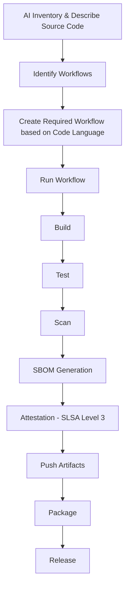

# devops-maturity-assessment

 

## DevOps Maturity Assessment Tool

DevOps Maturity Assessment offers the means to gather information about the current state of capabilities, methodologies and practices.

It offers the means to identify areas of improvement in the following areas:

- Deployment Frequency
- Lead Time for Changes
- Time to Restore Service
- Change Failure Rate

It should outline the steps required to achieve desired state towards DevOps maturity assessment goals.

## Purpose of this Application

This is a rapid prototype application with integration to Chainloop.

It was initially AI generated with [Bolt.diy](https://github.com/stackblitz-labs/bolt.diy) and [Copilot](https://copilot.microsoft.com/).

## Demo

We want to demo a developer flow using a modern AI solution such as Bolt.diy where the AI bot can look at a repository, inventory the code and create a workflow that does the following:

- inventory
- source code checkout
- set up a build environment
- build
- test
- scan
- create an SBOM
- create the attestation for SLSA Level3
- push artifacts
- package the application (containerize the software)
- release the package as a versioned artifact

Example Diagram of this pipeline can be found [here](https://github.com/arena-si-devops/docs/blob/main/DevOps-Best-Practice/ai-advanced-pipeline.md)

## Advanced DevOps Pipeline

